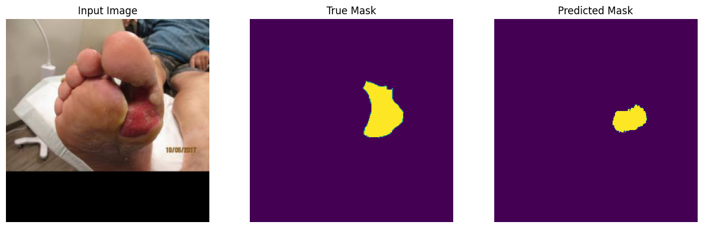
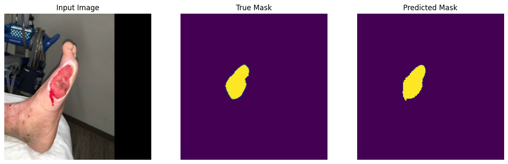
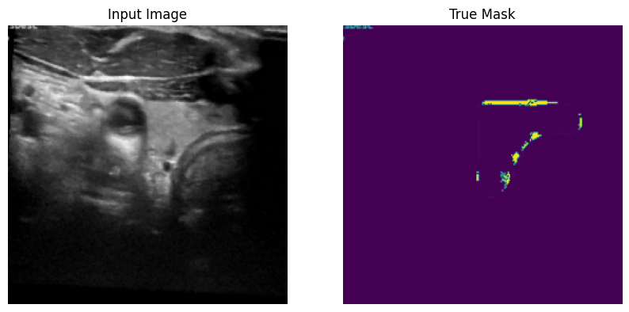

# Thyroid Image Segmentation using PyramidNet

## Project Overview
This project focuses on medical image segmentation of thyroid ultrasound images using a PyramidNet-based deep learning architecture. The objective is to accurately segment regions of interest such as thyroid nodules from ultrasound scans.

## Dataset
The project uses thyroid ultrasound datasets:
- TG3K Dataset
- DDTI Dataset

Due to GitHub file size limitations, the dataset is available here:
[(https://drive.google.com/drive/folders/1wy7bhbOzhf41rmqzB8x1dJ4PqRj412wx?usp=sharing)]

## Features
- Image preprocessing and normalization
- Visualization of annotated ultrasound images
- Deep learning-based segmentation using PyramidNet
- Generation of segmentation masks

## Technologies Used
- Python
- Jupyter Notebook
- NumPy
- OpenCV
- Matplotlib
- PyTorch

## Files
- thyroid_segmentation_pyramidnet.ipynb → Main notebook containing model and implementation

## How to Run
1. Open the notebook in Jupyter Notebook or Google Colab
2. Install required libraries: pip install numpy opencv-python matplotlib torch
3. Load dataset from provided link
4. Run all cells sequentially

## Output
- Segmented thyroid regions
- Visual comparison of original and predicted images

## Author
Aakash Shah

## Sample Results

| Image 1 | Image 2 | Image 3 |
|--------|--------|--------|
|  |  |  |
